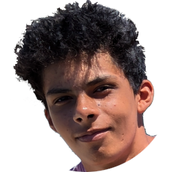

# Maïti Joanne

!!! tip "Stage"

    Je suis à la recherche d'un stage de découverte en entreprise
    pour mon année de seconde.

    [Téléchargez mon CV](assets/cv_maiti_joanne_sans_adr.pdf)

## :material-account-file-text: Profil

Je suis élève en seconde générale et technologique au lycée Gaspard Monge à Savigny sur Orge.

J'ai 15 ans et je suis un passionné de dessin et de jeux vidéos.

!!! danger inline ""

    { width="100" }

    ## Contact

    :material-phone: 06 63 33 87 37

    :simple-maildotru: maitijoanne@gmail.com

    :material-web: maitijoanne.github.io

  

    ## Compétences

    HTML  
    Python

    CapCut

    Anglais

    ## Centres d'intérêt

    Dessins et croquis

    [Projets Geometry Dash](portfolio/index.md)

    Taekwondo ceinture verte

    &nbsp;

    &nbsp;

    &nbsp;

    &nbsp;

    &nbsp;

    &nbsp;

    &nbsp;

    &nbsp;

    &nbsp;

    &nbsp;

    &nbsp;

    &nbsp;

    &nbsp;

    &nbsp;

    &nbsp;

    &nbsp;

    &nbsp;

    &nbsp;

    &nbsp;

    &nbsp;

    &nbsp;

    &nbsp;

    &nbsp;

    &nbsp;

    &nbsp;

    &nbsp;

    &nbsp;

## :material-office-building: Expériences

### Direction Générale des Finances Publiques, Bureau de l’Architecture et des Normes, Noisy-le-Grand

**Stage de 3^e^, découverte de l'entreprise et des métiers, Février 2024**

Découverte des métiers de l'informatique.  
Entrevue avec les équipes :

- UX Design avec interview
- Framework de développement Java
- Outillage informatique
- Développement dans le Cloud
- Cybersécurité

Le design concerne la création d'écrans pour des applications ou des services.  
Le métier d’UX Designer consiste à concevoir et s'assurer que le produit/interface est utile et utilisable.

**Comment ?**

- Utilisation d’outils (Sketch, Figma. Invision)
- Conception et test des prototypes
- Travail en équipe avec des utilisateurs,
développeurs, graphistes, et autres
métiers.

### Participation et communication autour de projets collaboratifs (Geometry Dash)
**Depuis 2021**

- Discussions actives (en anglais et en français) sur Discord avec plusieurs groupes
- Partage d’idées
- Résolution de problèmes pour atteindre des objectifs communs
- Échange de connaissances techniques et artistiques avec d’autres créateurs

### Création de contenu et contribution à des projets créatifs (Geometry Dash)
**Depuis 2021**

- Conception collaborative avec les communautés en ligne via Discord
- Développement de niveaux personnalisés pour le jeu [Geometry Dash](https://www.robtopgames.com/) ([voir le portfolio](portfolio/index.md))
- Utilisation d’outils de création (éditeur de niveaux Geometry Dash, montage vidéo CapCut)
- Application de principes de design pour produire du contenu engageant et créatif (décorations, effets, transitions, gameplay en rythme avec la musique)

## :material-school: Formation

### Seconde générale et technologique

**Lycée Gaspard Monge à Savigny sur Orge 91600**

### Diplôme national du brevet

**Collège de l'Institution du Sacré-Cœur à La Ville du Bois 91620**  
Mention bien.