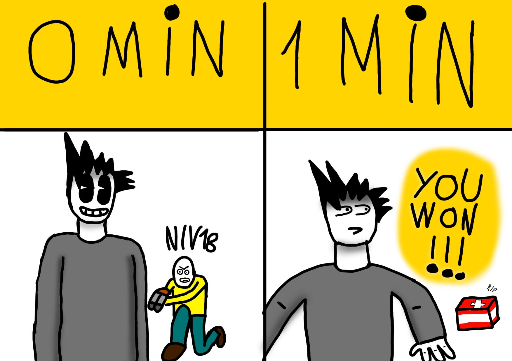

# Portfolio

Mon Portfolio est une collection de mes créations récentes.

{ width="560" }

## Gameplay et création de niveaux Geometry Dash

:simple-youtube: [Clash1528](https://www.youtube.com/@Clash1528CF)

J'ai créé des niveaux de jeu avec l'éditeur de niveaux de Geometry Dash.

Voici quelques vidéos de mes niveaux Geometry Dash montées avec le logiciel CapCut où j'ai rajouté des fondus en début et fin de vidéo.
D'autres vidéos avec un meilleur montage sont en cours de réalisation.

### Hypnotic Circles

<iframe width="560" height="315" src="https://www.youtube.com/embed/VzL0i8vUexY?si=B016RHE15BqnekHs" title="YouTube video player" frameborder="0" allow="accelerometer; autoplay; clipboard-write; encrypted-media; gyroscope; picture-in-picture; web-share" referrerpolicy="strict-origin-when-cross-origin" allowfullscreen></iframe>

Ce niveau est le premier que j'ai designé en m'inspirant d'un autre niveau s'appellant **Nine Circles**, ce niveau contient un effet appelé *nine circles effect* un effet rendant les obstacles hypnotisants.

### Unbalanced LVL

<iframe width="560" height="315" src="https://www.youtube.com/embed/HyU-7vt8wnY?si=nstgx3RDaF4OJakb" title="YouTube video player" frameborder="0" allow="accelerometer; autoplay; clipboard-write; encrypted-media; gyroscope; picture-in-picture; web-share" referrerpolicy="strict-origin-when-cross-origin" allowfullscreen></iframe>

Ce niveau est un des plus durs que j'ai fait, il ne contient pas de décorations mais juste quelques effets. Le niveau augmente en difficulté de façon à ce qu'il atteigne une difficulté très dure challengeant les joueurs se sentant capable de le finir.

### Constellation

<iframe width="560" height="315" src="https://www.youtube.com/embed/D73-slVeC6Q?si=QdVyS5-rnz8R7_YI" title="YouTube video player" frameborder="0" allow="accelerometer; autoplay; clipboard-write; encrypted-media; gyroscope; picture-in-picture; web-share" referrerpolicy="strict-origin-when-cross-origin" allowfullscreen></iframe>

Ce niveau est celui que j'ai le mieux décoré et peut-être le plus dur que j'ai jamais fait, je suis très fier de ce que j'ai fait sur celui-ci, il est inspiré de 2 niveaux iconiques de Geometry Dash.